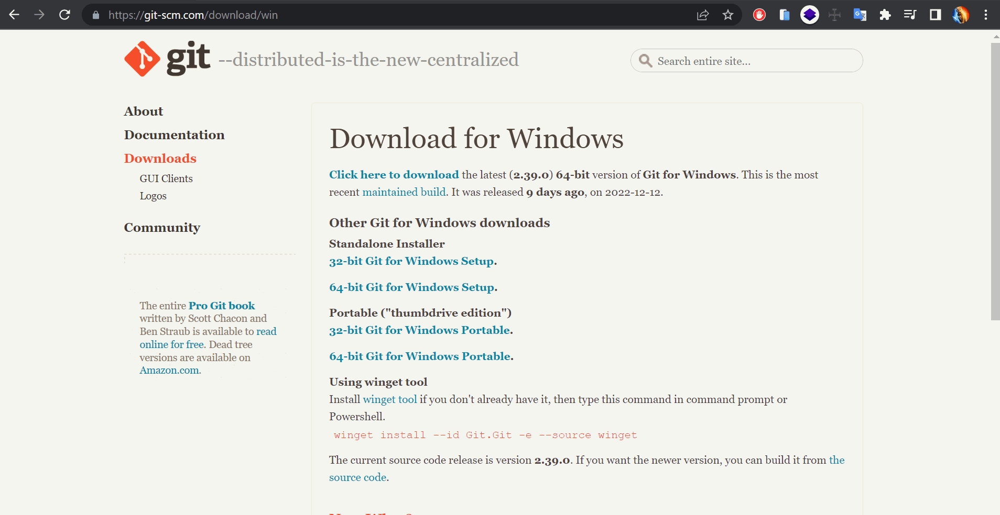
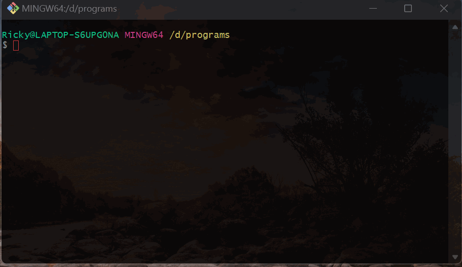
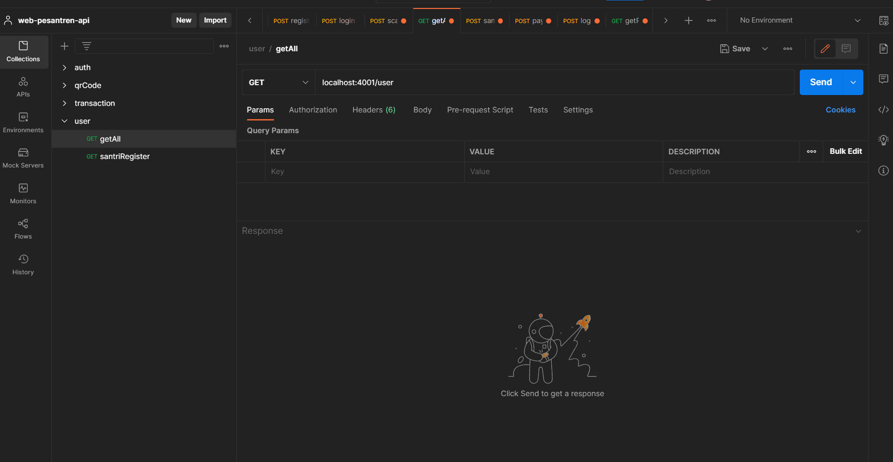
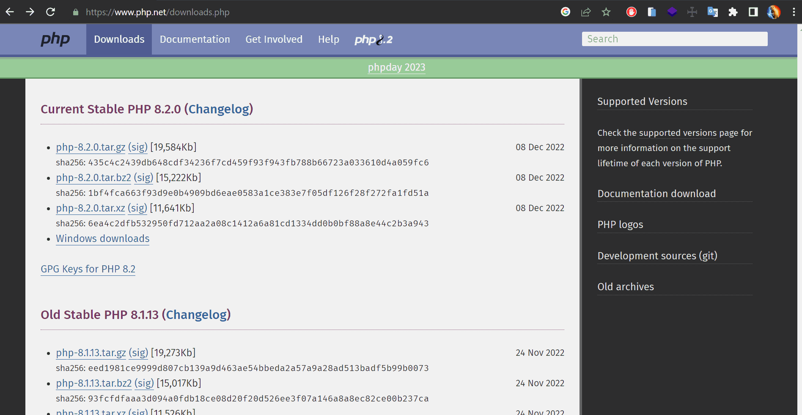
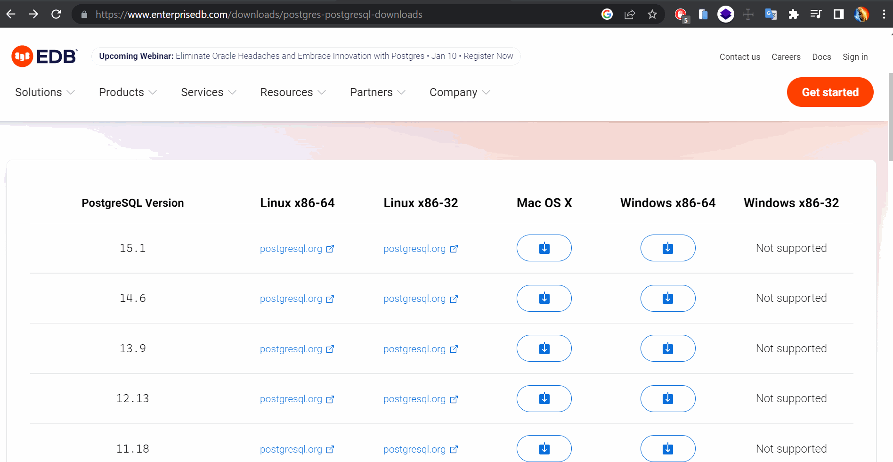
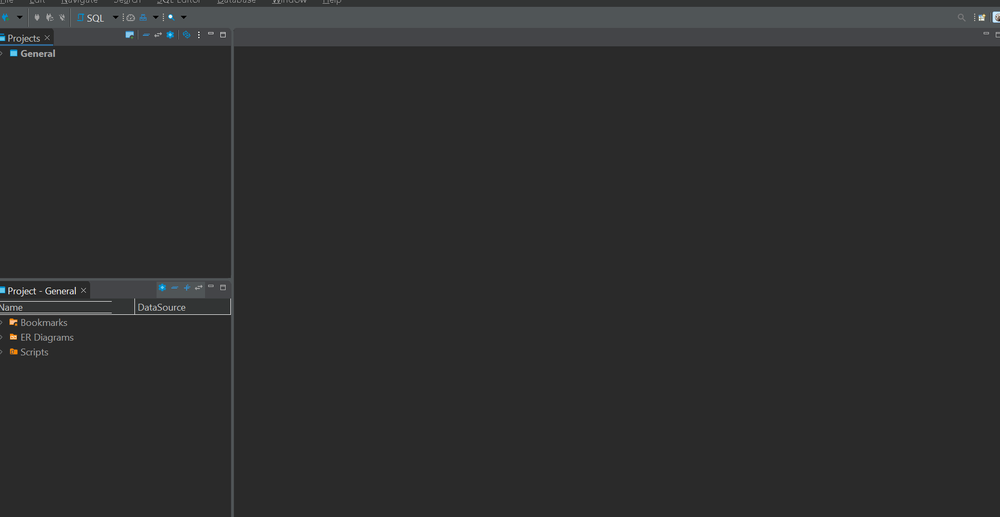
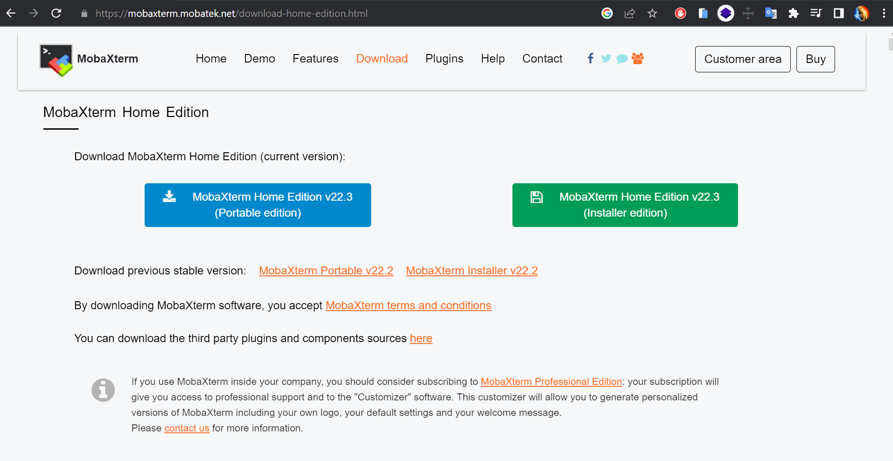
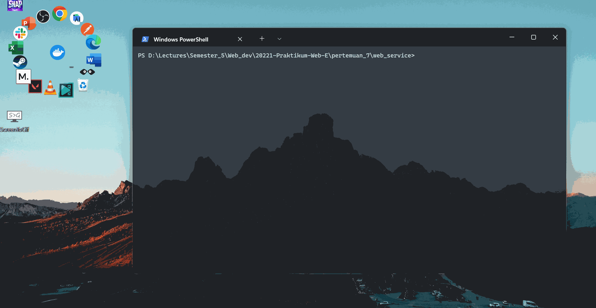
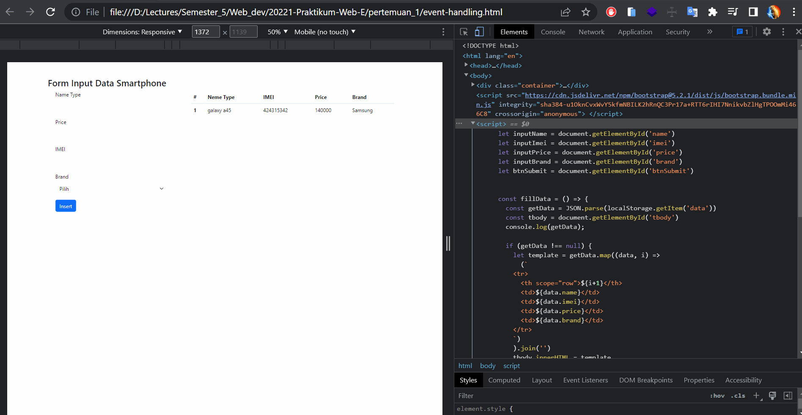

# Pertemuan 16
### Changelog
View at [Homepage](https://github.com/ricky03knowhere/IF215007#pertemuan-16)

- ✅ `CREATE` : Mengerjakan UAS
  - [Soal & Jawaban UAS Teori](#uas-teori)
- ✅ `CREATE` : Mengerjakan UAS Praktikum
  - [Soal & Jawaban UAS Praktikum](#uas-praktikum)

## UAS TEORI
- 🛠️🚀 Nama Projek : Sistem Informasi & Pendaftaran Online Pesantren Habiburrahman Banyuresmi Garut
- ⚡🚀 Link Demo (Youtube)   : [https://youtu.be/AmXxGHNFGu0](https://youtu.be/AmXxGHNFGu0)
- 💾 🔑 Backend (API) : [https://github.com/ricky03knowhere/web-pesantren-api](https://github.com/ricky03knowhere/web-pesantren-api)
- 🌈✨ Frontend (Website) : [https://github.com/ricky03knowhere/pesantren-habiburahman](https://github.com/ricky03knowhere/pesantren-habiburahman)
- 📱📶 Mobile App : [https://github.com/ricky03knowhere/pesantren-habiburahman-app](https://github.com/ricky03knowhere/pesantren-habiburahman-app)

## UAS PRAKTIKUM

<table>
    <thead>
        <tr>
            <th>CLO</th>
            <th>Bobot CLO</th>
            <th>Bentuk Asesmen</th>
            <th>Bobot Asesmen</th>
        </tr>
    </thead>
    <tbody>
        <tr>
            <td rowspan=13><a href="#clo-0211">CLO-0211</a></td>
            <td rowspan=13>30 %</td>
        </tr>
        <tr>
            <td><a href="#demo--git-installation"> Demo : Git installation</a></td><td>1</td>
        </tr>
        <tr>
            <td><a href="#demo--github-project-initialization"> Demo : Github project initialization</a></td><td>1</td>
        </tr>
        <tr>
            <td><a href="#demo--hoppscotch--postman-access"> Demo : Hoppscotch / Postman access</a></td><td>1</td>
        </tr>
        <tr>
            <td><a href="#demo--php--composer-installation--hello-world"> Demo : PHP & Composer installation & hello world</a></td><td>2</td>
        </tr>
        <tr>
            <td><a href="#demo--postgresql--mysql-installation"> Demo : PostgreSQL / MySQL installation</a></td><td>2</td>
        </tr>        
        <tr>
            <td><a href="#demo--dbeaver-installation--db-connection"> Demo : DBeaver installation & DB connection</a></td><td>2</td>
        </tr>
        <tr>
            <td><a href="#demo--mobaxterm-installation--ssh-connection"> Demo : MobaXterm installation & SSH connection</a></td><td>2</td>
        </tr>
        <tr>
            <td><a href="#demo--nodejs--npm-installation-operation--hello-world"> Demo : NodeJS & NPM installation, operation & hello world</a></td><td>4</td>
        </tr>
        <tr>
            <td><a href="#demo--linux-server-operation"> Demo : Linux server operation</a></td><td>5</td>
        </tr>
        <tr>
            <td><a href="#demo--nginx--apache-web-server-installation--operation"> Demo : Nginx / Apache web server installation & operation</a></td><td>5</td>
        </tr>
        <tr>
            <td><a href="#demo--cpanel-operation"> Demo : Cpanel operation</a></td><td>4</td>
        </tr>
        <tr>
            <td><a href="#demo--domain-registration"> Demo : Domain registration</a></td><td>1</td>
        </tr>
        <tr>
            <td rowspan=9><a href="#clo-0212">CLO-0212</a></td>
            <td rowspan=9>35 %</td>
        </tr>
        <tr>
            <td><a href="#demo--html-responsive-layout-with-media-query--flexbox"> Demo : HTML Responsive Layout with Media Query & Flexbox</a></td><td>3</td>
        </tr>
        <tr>
            <td><a href="#demo--javascript-data-transformation"> Demo : Javascript Data Transformation</a></td><td>4</td>
        </tr>
        <tr>
            <td><a href="#demo--browser-api---event-handling-local-storage-element-manipulation"> Demo : Browser API - Event Handling, Local Storage, Element manipulation</a></td><td>5</td>
        </tr>
        <tr>
            <td><a href="#demo--http-get--post-using-form-action-and-fetch-api"> Demo : HTTP GET & POST using Form Action and Fetch API</a></td><td>5</td>
        </tr>    
        <tr>
            <td><a href="#demo--php-db---dynamic-web-page"> Demo : PHP DB - Dynamic Web Page</a></td><td>5</td>
        </tr>
        <tr>
            <td><a href="#demo--php-db---web-service"> Demo : PHP DB - Web Service</a></td><td>5</td>
        </tr>
        <tr>
            <td><a href="#demo--oop-based-php-project-using-composer"> Demo : OOP-based PHP Project using Composer</a></td><td>4</td>
        </tr>    
        <tr>
            <td><a href="#demo--deploy-php-project-to-cpanel"> Demo : Deploy PHP Project to Cpanel</a></td><td>4</td>
        </tr>
        <tr>
            <td rowspan=6><a href="#clo-0213">CLO-0213</a></td>
            <td rowspan=6>35 %</td>
        </tr>
        <tr>
            <td><a href="#demo--html-responsive-layout-with-bootstrap">Demo: HTML Responsive Layout with Bootstrap</a></td><td>3</td>
        </tr>
        <tr>
            <td><a href="#demo--single-page-app-with-react--react-router"> Demo : Single Page App with React & React-router</a></td><td>12</td>
        </tr>
        <tr>
            <td><a href="#demo--dynamic-web-page-using-laravel"> Demo : Dynamic Web Page using Laravel</a></td><td>9</td>
        </tr>
        <tr>
            <td><a href="#demo--web-service-using-slim"> Demo : Web Service using Slim</a></td><td>6</td>
        </tr>
        <tr>
            <td><a href="#demo--news-site-using-wordpress"> Demo : News Site using Wordpress</a></td><td>5</td>
        </tr>
    </tbody>
</table>

## CLO-0211
### Demo : Git installation

### Demo : Github project initialization

### Demo : Hoppscotch / Postman access

### Demo : PHP & Composer installation & hello world

- 🚀 `Project` : [Comic Store (Laravel)](https://github.com/ricky03knowhere/comic_store)
### Demo : PostgreSQL / MySQL installation

### Demo : DBeaver installation & DB connection

### Demo : MobaXterm installation & SSH connection

### Demo : NodeJS & NPM installation, operation & hello world

### Demo : Linux server operation
- ⚡`Lecture` : [Pertemuan 12](https://github.com/ricky03knowhere/IF215007/tree/main/pertemuan_12)
### Demo : Nginx / Apache web server installation & operation
- ⚡`Lecture` : [Pertemuan 13](https://github.com/ricky03knowhere/IF215007/tree/main/pertemuan_13)
### Demo : Cpanel operation
- None
### Demo : Domain registration
- None

## CLO-0212
### Demo : HTML Responsive Layout with Media Query & Flexbox
- ⚡`Lecture` : [Pertemuan 2](https://github.com/ricky03knowhere/IF215007/tree/main/pertemuan_2)
### Demo : Javascript Data Transformation

### Demo : Browser API - Event Handling, Local Storage, Element manipulation

### Demo : HTTP GET & POST using Form Action and Fetch API
- ⚡`Lecture` : [Pertemuan 2](https://github.com/ricky03knowhere/IF215007/tree/main/pertemuan_2)
### Demo : PHP DB - Dynamic Web Page
- 🚀 `Project` : [Comic Store (Laravel)](https://github.com/ricky03knowhere/comic_store)
### Demo : PHP DB - Web Service
- 🚀 `Project` : [Comic Store (Laravel)](https://github.com/ricky03knowhere/comic_store)
### Demo : OOP-based PHP Project using Composer
- 🚀 `Project` : [Comic Store (Laravel)](https://github.com/ricky03knowhere/comic_store)
### Demo : Deploy PHP Project to Cpanel
- None

## CLO-0213
### Demo : HTML Responsive Layout with Bootstrap
- 🚀 `Project` : [Website Portfolio (Bootstrap)](https://github.com/ricky03knowhere/ricky03knowhere.github.io)
- 🌐 `Website` : [https://ricky03knowhere.github.io/](https://ricky03knowhere.github.io/)

### Demo : Single Page App with React & React-router	
- 🚀 `Project` : [Website Pesantren (React)](https://github.com/ricky03knowhere/pesantren-habiburahman)
### Demo : Dynamic Web Page using Laravel
- 🚀 `Project` : [Comic Store (Laravel)](https://github.com/ricky03knowhere/comic_store)
### Demo : Web Service using Slim
- None
### Demo : News Site using Wordpress
- None